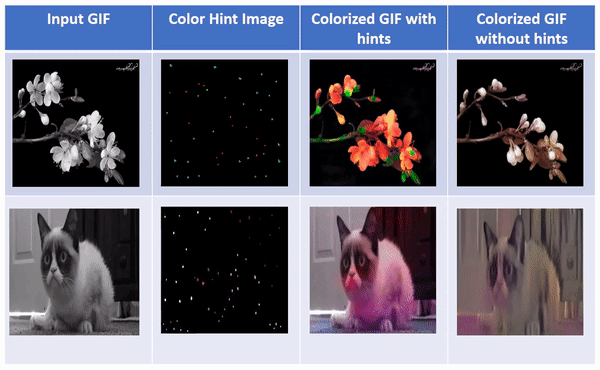

# Colorization of black and white videos and style transfer

## Running the code

* Train the colorization model using the command `bash ./scripts/train_siggraph.sh`
    * The image folder for training is defined in `options/base_options.py`, edit it before starting the training
* Test the model by creating the following directory structure:
    * Grayscale image frames in `dataset/custom/val/imgs`
    * Color hints in `dataset/ref/imgs` (please clone the color hint `N` times where N = number of files in the previous step)
    * Run `./full.sh` and see the final `gif` generated as `out.gif` in the main folder

## Example result

